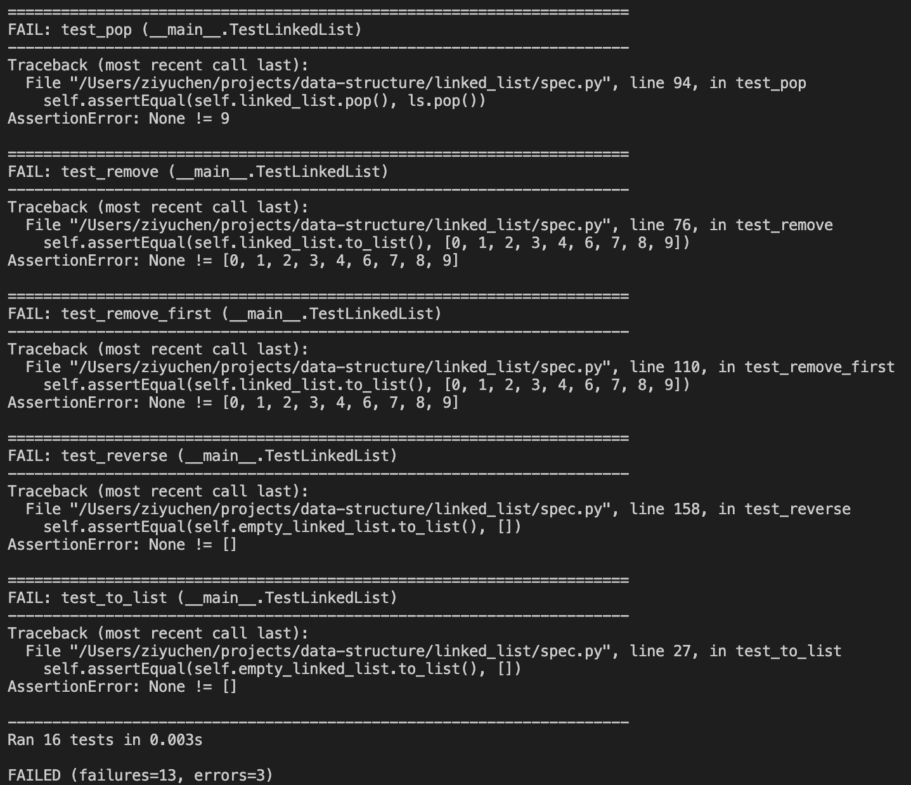
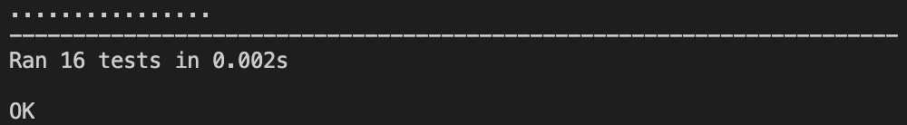

# Linked List

Hey amigo! Welcome to your first data structure lesson. You will be studying the basics of Linked List, one of the simplest data structures in the world of Computer Science. That said, Linked List isn't that easy for beginners like you and you might find some concepts confusing or not intuitive, but I have faith in your programming skills! You can do it! 

After learning the basics, you will also be implementing your very own Linked List. Sounds exciting? Let's get started!

## Prerequisites
1. Basic understanding of how loops (especially `while` loops) work in Python
2. Basic knowledge of class in Python

## Instructions:
1. Read the following articles:
[Pointers in Python](https://realpython.com/pointers-in-python/), 
[Introduction to Linked List](https://www.geeksforgeeks.org/linked-list-set-1-introduction/),
[Linked List Algorithms](https://www.tutorialspoint.com/data_structures_algorithms/linked_list_algorithms.htm).
Feel free to do more research if the above reading materials aren't enough for you. However, DO NOT look for other people's implementation of Linked List.

2. Complete all the methods in index.py. You will find detailed explanations of what each method does to or with the linked list. Try it yourself first. You can refer to other people's code if you have trouble with any of the methods, but DO NOT directly copy other people's code (Copying and pasting is NOT learning).

3. After you finish each method, run the code in spec.py. There are altogether 16 tests in spec.py corresponding to the 16 linked list methods in index.py. If you run it before writing any code, you will see the following:

Your end goal is basically to make your Linked List pass all the tests in spec.py. If all the tests have been passed, you will see the following:

4. Submit your Linked List to me in exchange for mine. (Yes, I have written my own version of Linked List as well lol)

## Tips:
1. `while`, counters and pointers are your good friends when writing your own version of linked list. (Look them up if you don't know what they are)
2. Remember to update `self.head`, `self.tail` and `self.length`.
3. You can invoke one method inside another to avoid writing repetitive code.
